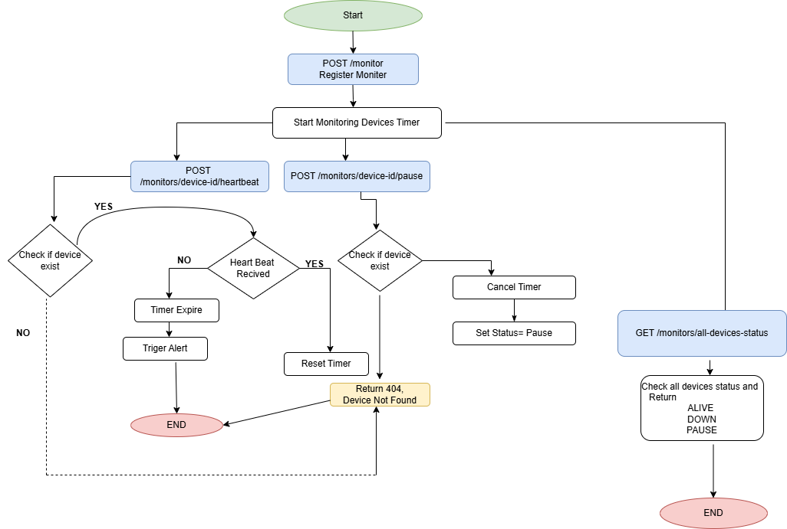

# 1. Architecture Diagram



---

# 2. Project Structure

```
Pulse-Check-API
│
├── app.py  #this is the main application file
├── requirements.txt  # this is the requirment that must be install before 
├── README.md  # this is the project doucmentation 
└── ArchitectureDiagram.png # this is the Flow chart of how the architecture of the project works 
```

---

# 3. Setup Instructions

Follow these steps to run the project on your computer.

---

## 1. Clone the Repository

After cloning the repository, move into the project folder:

```bash
cd Pulse-Check-API
```

---

## 2. Install Dependencies

Make sure **Python 3** is installed on your computer.

Install the required packages:

```bash
pip install -r requirements.txt
```

Main package used:

* Flask

---

## 3. Run the Server

Start the application.

If you are using **VS Code**, open the built-in terminal by pressing:

```
Ctrl + `
```

Or open **Command Prompt (cmd)** and navigate to the project folder.

Run:

```bash
python app.py
```

If everything works correctly, you should see something like:

```
* Running on http://127.0.0.1:5000
```

---

## 4. Test the API

You can test the endpoints using **curl** or **Postman**.

Example: Register a device.

### On Windows CMD

```
curl -X POST http://127.0.0.1:5000/monitors -H "Content-Type: application/json" -d "{\"device_id\":\"device-1\",\"timeout\":10,\"alert\":\"salim@gmail.com\"}"
```

### On Bash (Linux, Mac, Git Bash)

```
curl -X POST http://127.0.0.1:5000/monitors -H "Content-Type: application/json" -d '{"device_id":"device-1","timeout":10,"alert":"salim@gmail.com"}'
```

This creates a new monitor and starts tracking the device.

---

## 5. Stop the Server

Press:

```
CTRL + C
```

to stop the server.

---

# 4. API Documentation


# 1. Register a Monitor

Registers a new device and starts the monitoring timer.

### Endpoint

```
POST /monitors
```

### Request Body

```json
{
  "device_id": "device-1",
  "timeout": 10,
  "alert": "admin@email.com"
}
```

### Curl Test (CMD)

```
curl -X POST http://127.0.0.1:5000/monitors -H "Content-Type: application/json" -d "{\"device_id\":\"device-1\",\"timeout\":10,\"alert\":\"salim@gmail.com\"}"
```

### Curl Test (Bash)

```
curl -X POST http://127.0.0.1:5000/monitors -H "Content-Type: application/json" -d '{"device_id":"device-1","timeout":10,"alert":"salim@gmail.com"}'
```

### Response

```json
{
  "message": "Monitoring device-1 created with timeout 10 seconds"
}
```

### What Happens

1. The device is registered.
2. A timer starts with the specified timeout.
3. If the timer expires before a heartbeat is received, an alert is triggered.

Example alert on the server:

```
{'ALERT': 'Device device-1 is down', 'time': '15:33:30 2026-03-14'}
```

---

# 2. Send Heartbeat

Devices send heartbeats to reset the monitoring timer.

### Endpoint

```
POST /monitors/{device_id}/heartbeat
```

### Example

```
POST /monitors/device-1/heartbeat
```

### Curl Test

```
curl -X POST http://127.0.0.1:5000/monitors/device-1/heartbeat
```

### Response

```json
{
  "message": "Heartbeat received from device-1"
}
```

### What Happens

1. The system checks if the device exists.
2. The current timer is cancelled.
3. A new timer starts again from the beginning.

---

# 3. Pause Monitoring

This endpoint pauses monitoring for a device.

### Endpoint

```
POST /monitors/{device_id}/pause
```

### Example

```
POST /monitors/device-1/pause
```

### Curl Test

```
curl -X POST http://127.0.0.1:5000/monitors/device-1/pause
```

### Response

```json
{
  "message": "Monitor device-1 successfully paused"
}
```

### What Happens

1. The device timer is cancelled.
2. Monitoring is paused.
3. No alert will trigger while paused.

---

# 4. Update Monitor Timeout(Developer’s Choice Feature)

This endpoint allows administrators to **update the timeout of an already registered device**.

### Endpoint

```
PUT /monitors/{device_id}/timeout
```

### Example

```
PUT /monitors/device-1/timeout
```

### Request Body

```json
{
  "timeout": 20
}
```

### Curl Test

```
curl -X PUT http://127.0.0.1:5000/monitors/device-1/timeout -H "Content-Type: application/json" -d "{\"timeout\":20}"
```

### Response

```json
{
  "message": "Timeout for device-1 updated to 20 seconds"
}
```

### What Happens

1. The system checks if the device exists.
2. The current timer is cancelled.
3. The timeout value is updated.
4. A new monitoring timer starts using the updated timeout.

This feature allows administrators to adjust monitoring intervals without deleting and recreating monitors.

---

# 5. Get All Device Status (Developer’s Choice Feature)

This endpoint shows the **status of all monitored devices**.

### Endpoint

```
GET /monitors/devices-status
```

### Curl Test

```
curl http://127.0.0.1:5000/monitors/devices-status
```

### Response

```json
[
  {
    "device_id": "device-1",
    "status": "down"
  },
  {
    "device_id": "device-2",
    "status": "alive"
  },
  {
    "device_id": "device-3",
    "status": "paused"
  }
]
```

### What Happens

The system loops through all registered monitors and returns the **current status of each device**.

---

# Device Status Types

| Status | Meaning                                              |
| ------ | ---------------------------------------------------- |
| ALIVE  | Device is sending heartbeats and is working normally |
| PAUSED | Monitoring is temporarily paused                     |
| DOWN   | Device failed to send heartbeat before timeout       |

---

# Developer Choice Explanation

 
The Device Status Endpoint and Update Timeout Endpoint were added as developer enhancements to make the monitoring system more practical and flexible.

Device Status Endpoint: Provides a quick overview of all devices in one request, so administrators don’t have to check each device individually. This makes system monitoring easier and more efficient.

Update Timeout Endpoint: Allows administrators to dynamically adjust the monitoring interval for any device without deleting and recreating monitors. This gives greater control and flexibility over device monitoring.

